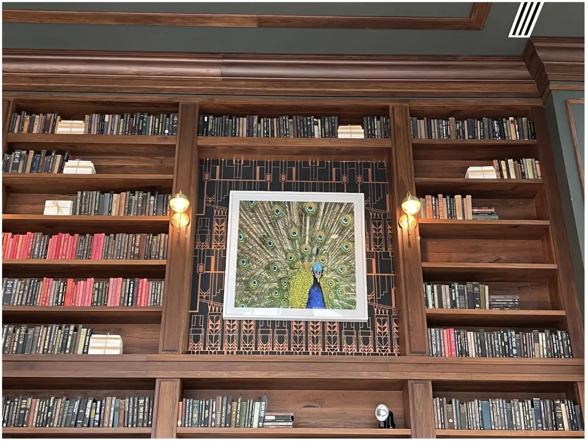
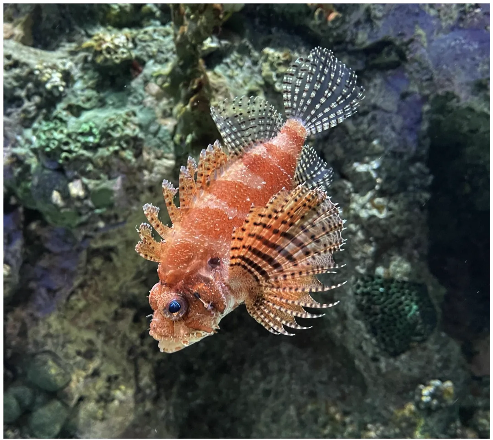
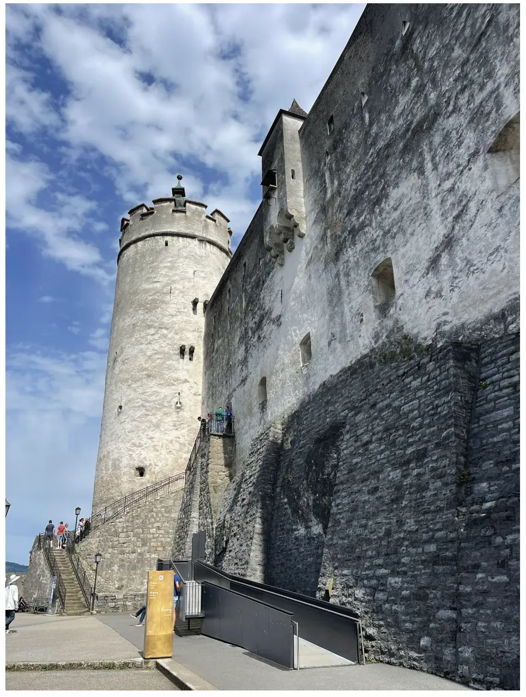

图像视频打标范例

图像打标：

|  ||
| ----------- | ----------- |
|一张正面、眼平高度的照片捕捉了一个精心组织的书架，书架中心是一幅醒目的孔雀绘画，两侧各有一盏对称的壁挂式灯具，背景是引人注目的黑色和橙色的艺术装饰风格壁纸。书架由深色的、富丽堂皇的木材制成，填满了整个画面，创造了一种对称和审美上令人愉悦的构图。书架上堆满了各种颜色的书籍，主要以深黑色和鲜艳的红色为主，以颜色编码的方式整齐排列。在左侧的架子上，书籍以明显的红色和黑色交替排列，形成平衡的图案。右侧的架子上主要摆满了黑色的书籍，间杂着一些中性色调的书籍，还偶尔放置着一些物品，如用黄色丝带整齐包装的白色礼物。在中央，一幅引人注目的孔雀画，其层叠的羽毛以鲜艳的绿色、蓝色和金色呈现，被白色框架装裱。孔雀的羽毛以复杂的形式展开，成为与深色、几何图案壁纸背景形成美丽对比的焦点。孔雀的皇家和细致描绘为场景增添了活泼的色彩和奢华感。画作两侧的是两盏传统风格的壁挂式灯，柔和的温暖光线从黄铜灯具中的圆形灯泡发出。这些灯不仅增强了中央的绘画效果，还为这个现代、光滑的书架提供了舒适而古典的氛围。背景墙以艺术装饰风格的图案装饰，黑色和微妙的橙色的角度和线条相结合，为整体美学增添了经典复杂性与现代设计的交集。整体构图平衡且对称，利用了强烈的水平和垂直对齐，吸引视线到中心。整齐组织的书籍、奢华的孔雀画和温暖的灯光营造了一个精致而邀请的氛围，适合于研究室或时尚图书馆的设置。场景通过自然或环境光照明，增强了木制书架的温暖和丰富性以及其中物品的鲜艳色彩。|A straight-on, eye-level shot captures an intricately organized bookshelf with a central peacock painting, flanked by two symmetrical wall-mounted lamps, all set against a striking Art Deco patterned black and orange wallpaper. The bookshelf, made of rich, dark wood, fills the entire frame, creating a symmetrical and aesthetically pleasing composition. The unit is stacked with an array of books in various hues, primarily dominated by deep blacks and vibrant reds neatly arranged in a color-coded manner. On the left shelves, the books are organized with noticeable shades of red and black alternating in a balanced pattern. On the right, the shelves are filled mostly with black books interspersed with some neutrally-colored tomes, and there are items sporadically placed, like neatly wrapped white presents with yellow ribbons. At the center, an eye-catching painting of a peacock, with its cascading feathers in vibrant greens, blues, and golds, is framed in white. The peacock's feathers fan out in an elaborate display, creating a focal point that contrasts beautifully with the dark, geometric-patterned wallpaper behind it. The regal and detailed depiction of the peacock adds a lively splash of color and luxury to the scene. Flanking the painting are two traditional-style wall-mounted lamps with soft, warm light emanating from round bulbs held in brass fixtures. These lights not only enhance the central painting but provide a cozy and classic ambiance to the otherwise modern, sleek bookshelves. The background wall, adorned in an Art Deco pattern with combined angles and lines in black and subtle orange, enriches the overall aesthetic with a touch of classic sophistication intersecting with modern design. Overall, the composition is balanced and symmetrical, utilizing a strong horizontal and vertical alignment that draws the eye to the center. The well-organized books, luxurious peacock painting, and warm lighting create a refined and inviting atmosphere suitable for a study or a stylish library setting. The scene is lit by natural or ambient light enhancing the warmth and richness of the wooden shelves and the vibrant hues of the objects within.|

|  ||
| ----------- | ----------- |
|一张特写镜头呈现了一幅引人注目的红色狮子鱼图像，鱼在水族馆中游动时，它独特而华丽的鳍部鲜明地展现出来。狮子鱼身体稍微向左倾斜，展示了其带有橙色和白色条纹的身体，身体覆盖着带有复杂深色图案的刺状鳍。狮子鱼的大而圆的眼睛是一个迷人的焦点，加之其下垂的嘴和头部表面的小刺状突起。背鳍在身体上方升起，展示出带有点状线条的透明扩展部分，类似于精致的蕾丝。胸鳍优雅地展开，如同细腻的羽毛，与鱼健壮的形态形成鲜明的视觉对比。鳍部进一步以一系列优雅的纵向条纹为特征，这些条纹在深浅色调之间交替，增强了生物的异国情调。狮子鱼在自然珊瑚形成和海洋生长的背景中占据了中心舞台。背景以绿色、棕色和紫色的暗示为主，细节描绘了一个多岩石的水族馆环境。质感的岩石表面特征有凸起、裂缝和微小的海洋生物，提供了一个自然主义的设置，强调了水生栖息地。柔和的照明配上轻柔的阴影，微妙地照亮了狮子鱼及其周围的环境，创造了一个宁静的水下场景。背景的模糊部分暗示了深度，将注意力锐利地集中在狮子鱼的生动细节上。|A close-up shot presents a striking image of a red lionfish, prominently displaying its unique and ornate fins as it swims in an aquarium. The lionfish, angled slightly to the left, reveals its banded orange and white body covered in spiny fins, each adorned with intricate, dark patterns. The lionfish's large, round eyes are a captivating point of focus, along with its downturned mouth and small, barb-like projections along the head’s surface. The dorsal fins, elevated above the body, exhibit translucent extensions with dotted lines, resembling delicate lace. Pectoral fins fan out gracefully like delicate feathers, creating a dramatic visual contrast against the fish’s robust form. The fins are further characterized by a series of elegant, longitudinal stripes that alternate between dark and light tones, enhancing the creature’s exotic appearance. The lionfish takes center stage against a background of natural coral formations and marine growth. Various shades of green, brown, and hints of purple dominate the background, detailing a rocky aquarium environment. The textured rock surfaces feature bumps, crevices, and tiny marine life, providing a naturalistic setting that emphasizes the aquatic habitat. The subdued lighting, coupled with soft shadows, subtly illuminates both the lionfish and its surroundings, creating a tranquil underwater scene. The blurred portions of the background hint at depth, focusing attention sharply on the vivid details of the lionfish.|

|  ||
| ----------- | ----------- |
|一个戏剧性的低角度镜头捕捉到一座屹立的中世纪石制城堡，其上有一个圆柱形的塔楼和一堵延伸的石墙，背景是鲜蓝的天空和飘逸的白云。这一场景充满了建筑细节和人类互动。位于左侧的圆柱形塔楼顶部装饰有垛口的女儿墙，并在顶部附近设有小的矩形开口。一个较小的矩形塔楼从主塔的一侧突出，增加了中世纪的美感。塔楼的表面因风化呈现出淡灰色和深灰色的混合色调。向右延伸的巨大、古老的石墙以其粗糙不平的质地展示了明显的磨损痕迹和历史特征。沿着墙面间隔分布着几个狭窄的矩形窗户，每个都深嵌入石头中，营造出一种加固的孤立感。墙的基座由深灰色的石头按粗糙的纹理排列组成，加强了结构坚固和古老的外观。场景中可见人们的互动；左侧有几个穿着休闲现代服装的人站在石阶上。阶梯向左上方弯曲，旁边配有铁栏杆，将历史元素与实用的现代细节（如沿其侧面安装的街灯）相结合。在上方石阶的下方，一条现代黑色金属扶手沿着斜坡向下延伸，将古老的石头与当代设计元素形成对比。在金属斜坡的右侧，立着一个金色的矩形信息标牌，提供有关城堡的详情，将过去与现在联系起来。远处，隐约可见更多的历史建筑，延伸了城堡综合体的背景。鲜蓝的天空和蓬松的白云背景增强了清晰和宏伟的感觉，为整个场景投下了戏剧性而宁静的氛围。整体构图强调了历史元素的耐久性与现代人类存在之间的对比，捕捉了中世纪建筑的永恒性和规模。|A dramatic, low-angle shot captures a towering medieval stone castle with a cylindrical turret and a sprawling stone wall beneath a vivid blue sky with wispy white clouds. The scene is filled with architectural details and human interactions. The cylindrical turret, positioned on the left, is crowned with a crenellated parapet and includes small rectangular openings near the top. A smaller, rectangular turret juts out from the side of the main turret, adding to the medieval aesthetic. The turret's surface is weathered with a mix of light and dark grey tones. Extending to the right, a massive, aged stone wall showcases its rough, uneven texture with visible patches of wear and historical character. Several narrow, rectangular windows are interspersed along the wall, each set deep into the stone, creating a sense of fortified isolation. The wall's base is constructed of darker grey stones arranged in a coarse, textured pattern, reinforcing the structure's solid and ancient appearance. People are seen interacting within the scene; several individuals stand on a stone staircase on the left side, wearing casual modern clothing. The staircase curves upwards to the left and is lined with iron railings, pairing historical elements with practical modern details like the street lamps mounted along its side. Below the upper stone staircase, a modern black metal handrail extends down a ramp, contrasting the ancient stone with contemporary design elements. To the right of the metal ramp, a golden rectangular information sign stands, providing details about the castle and connecting the past with the present. In the distance, hints of additional historic architecture are visible, extending the context of the castle complex. The backdrop of a blue sky with fluffy white clouds enhances the sense of clarity and grandeur, casting a dramatic yet serene atmosphere over the entire scene. The overall composition emphasizes the contrast between timeworn historical elements and modern-day human presence, capturing the timelessness and scale of the medieval architecture.|

| <video id="video" controls="" preload="none" poster="封面">
	<source id="video1.mpt" src="mp4 格式视频" type="video/mp4">
</videos> ||
| ----------- | ----------- |
